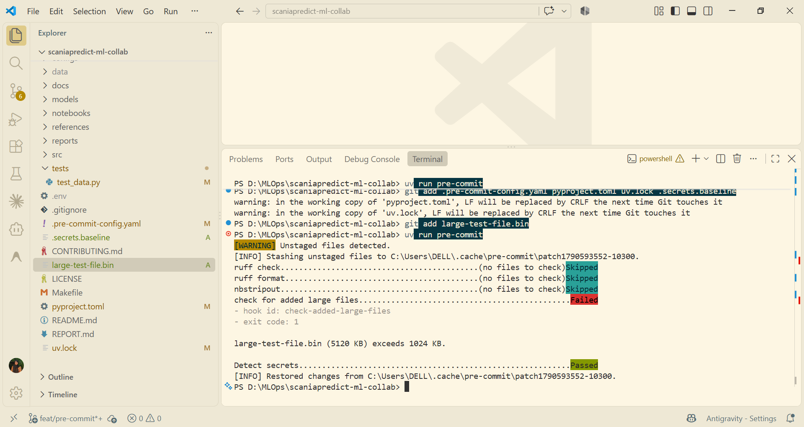
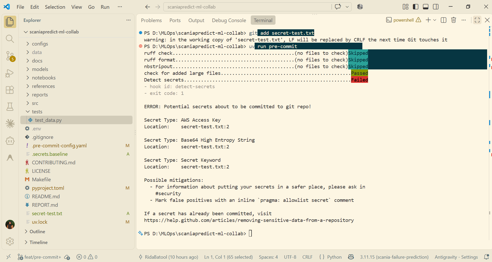
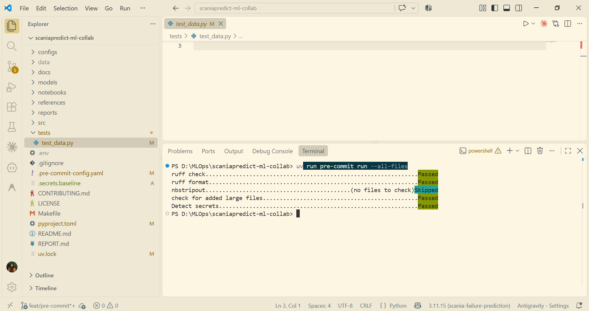
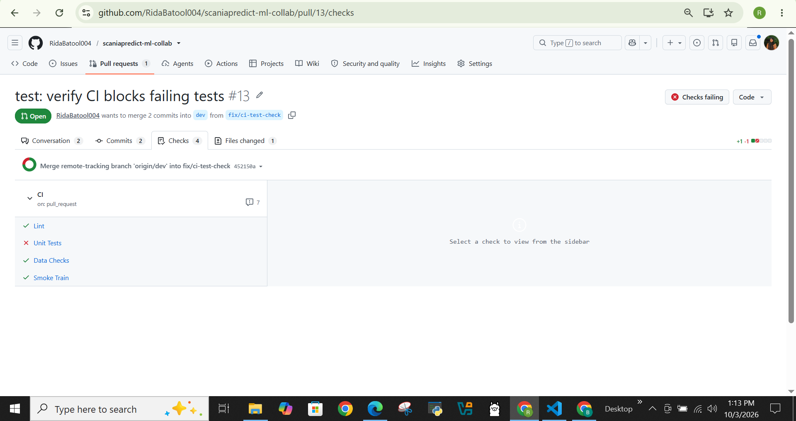
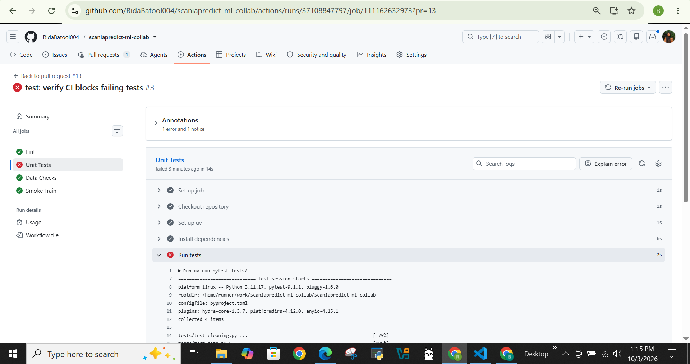
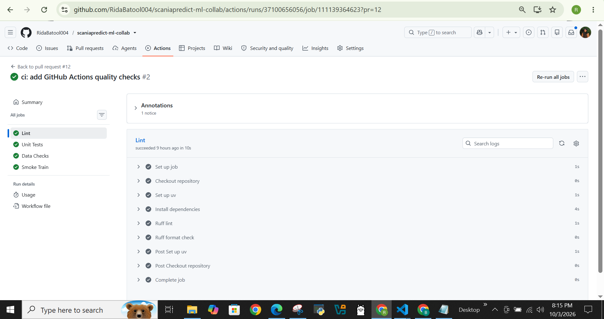
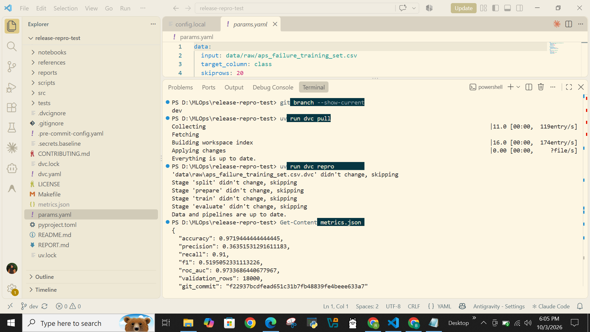

# Scania Truck Failure Prediction — MLOps Collaboration Report

## 1. Project Overview

This project implements a reproducible machine learning workflow for predicting failures in Scania trucks using sensor data from the UCI APS Failure at Scania Trucks dataset.

The project was completed as a two-member collaborative MLOps project using Git, GitHub Pull Requests, DVC, `uv`, pre-commit, automated testing, GitHub Actions, reproducible ML experiments, and protected branch workflows.

Repository:

https://github.com/RidaBatool004/scaniapredict-ml-collab

The project completed all nine required phases, from repository setup and collaborative branching through DVC versioning, reproducible experimentation, CI, release validation, and the `model-v1.0` production tag.

### Team

| Member      | Role                          | Main responsibilities                                                                                                                            |
| ----------- | ----------------------------- | ------------------------------------------------------------------------------------------------------------------------------------------------ |
| Rida Batool | Model Owner / Platform & CI   | Reproducible ML pipeline, model experiments, DVC workflow, CI/CD, branch protection, experiment evaluation, integration, release reproducibility |
| Maryam      | Data Owner / ML Collaboration | EDA, data versioning, model tuning experiments, data split change, peer review, release workflow                                                 |

---

## 2. Dataset and Starter Code

### Dataset

The project uses the **APS Failure at Scania Trucks** dataset from the UCI Machine Learning Repository.

The dataset contains sensor measurements collected from heavy Scania trucks. The prediction target is the `class` column with two classes:

* `neg` — no failure
* `pos` — failure

The training dataset used in the project contains:

* 60,000 rows
* 170 sensor features
* 1 target column
* 171 columns in total

The raw dataset contains missing values represented as `na`.

Dataset source:

https://archive.ics.uci.edu/dataset/421/aps+failure+at+scania+trucks

The raw training dataset is tracked using DVC rather than committed directly to Git history.

### Starter code

The repository was initialized using the Cookiecutter Data Science project structure and then adapted for the Scania failure prediction task.

Starter-code source:

https://github.com/drivendataorg/cookiecutter-data-science

The generated structure was adapted to include the project's DVC pipeline, model-training code, tests, experiment workflow, documentation, and CI configuration.

---

## 3. Project Workflow

The project followed the required collaboration flow:

```text
feature/data branches
        ↓
       dev
        ↓
    staging
        ↓
      main
        ↓
  model-v1.0
```

Permanent branches:

* `dev` — integration branch
* `staging` — release candidate and reproducibility validation
* `main` — production and release branch

Short-lived branches were used for:

* `feat/<name>` — features
* `data/<name>` — data changes
* `exp/<member>-<idea>` — experiments
* `fix/<name>` — fixes

Experiment branches were not merged directly into permanent branches. DVC experiments were used to compare configurations, and selected configurations were promoted through the normal feature/PR workflow.

Protected branches required pull requests, peer review, and required CI checks before merging.

---

# 4. Reproducible ML Pipeline

The final machine learning pipeline is implemented using four DVC stages:

```text
split
  ↓
prepare
  ↓
train
  ↓
evaluate
```

### Split

The dataset is divided into training and validation sets using:

* 70% training data
* 30% validation data
* `random_state = 42`
* stratification by the target class

The final release therefore contains:

* 42,000 training rows
* 18,000 validation rows

### Prepare

The preprocessing stage performs:

* median imputation
* standardization using `StandardScaler`
* fitting preprocessing only on the training data
* applying the fitted preprocessing to the validation data

All 170 sensor features are retained.

### Train

The final released model is Logistic Regression.

The released configuration stored in `params.yaml` is:

```yaml
model:
  type: logistic_regression
  C: 10
  max_iter: 100
  class_weight: balanced
  solver: lbfgs
  random_state: 42
```

The final `main` branch records this configuration in `params.yaml`, and the corresponding values are also recorded in `dvc.lock`.

### Evaluate

The evaluation stage calculates:

* Accuracy
* Precision
* Recall
* F1
* ROC-AUC

The evaluation stage also records the Git commit SHA in `metrics.json` to provide traceability between model results and source code.

---

# 5. Released Model Reproducibility

The final release is identified by the Git tag:

```text
model-v1.0
```

The final released pipeline uses the 70/30 train/validation split and the Logistic Regression configuration recorded in the release `params.yaml` and `dvc.lock`.

### Released configuration

| Reproducibility item         | Released value                                 |
| ---------------------------- | ---------------------------------------------- |
| Release                      | `model-v1.0`                                   |
| Git commit SHA               | c0d3b07054fc852260799f973b1ac94eabd4bda9            |
| Dataset                      | UCI APS Failure at Scania Trucks               |
| Dataset rows                 | 60,000                                         |
| Features                     | 170                                            |
| Data split                   | 70% training / 30% validation                  |
| Training rows                | 42,000                                         |
| Validation rows              | 18,000                                         |
| `target_column`              | `class`                                        |
| `skiprows`                   | `20`                                           |
| `random_state`               | `42`                                           |
| `test_size`                  | `0.30`                                         |
| Missing-value representation | `na`                                           |
| Missing-value handling       | Median imputation                              |
| Missing threshold            | `0.95`                                         |
| Model                        | Logistic Regression                            |
| `C`                          | `10`                                           |
| `max_iter`                   | `100`                                          |
| `class_weight`               | `balanced`                                     |
| `solver`                     | `lbfgs`                                        |
| Model random state           | `42`                                           |
| Raw dataset DVC hash         | `df9a09ae5b0c9555d7821a73fef8801d`             |
| `dvc.lock`                   | Final release lock file                        |
| Reproduction verification    | Independent fresh-clone reproduction completed |

The final DVC lock records the raw dataset hash as `df9a09ae5b0c9555d7821a73fef8801d` and records the final model artifact as `60c1a5d44a24d1a6c04cb199a1906e85`.

### Final released metrics

The following values should be copied directly from the final Phase 9 `metrics.json` produced during the independent reproducibility test:

| Metric          |                                         Final value |
| --------------- | --------------------------------------------------: |
| Accuracy        |                                `0.9719444444444445` |
| Precision       |                               `0.36351531291611183` |
| Recall          |                                              `0.91` |
| F1              |                                `0.5195052331113226` |
| ROC-AUC         |                                `0.9733686440677967` |
| Validation rows |                                            `18,000` |
| Git commit      |        **f22937bcdfead651c31b7fb48839fe4beee633a7** |

The independent reproduction was used as the release acceptance test. The reproduced `metrics.json` matched the release metrics exactly.

---

# 6. Experiment Comparison

Both team members conducted model experiments using DVC while keeping the reproducible pipeline and fixed random seeds.

## 6.1 Rida — `max_iter` experiments

Rida evaluated different `max_iter` values while keeping the Logistic Regression configuration fixed at `C=0.1`, `class_weight=balanced`, `solver=lbfgs`, and `random_state=42`.

The experiments were performed on the earlier 80/20 validation split before the final 70/30 data-version change.

| Experiment   | `max_iter` | Accuracy | Precision |  Recall |      F1 |     ROC-AUC |
| ------------ | ---------: | -------: | --------: | ------: | ------: | ----------: |
| `strip-cons` |        100 |  0.97250 |   0.37103 | 0.93500 | 0.53125 | **0.97946** |
| `nicer-tint` |        500 |  0.97217 |   0.36811 | 0.93500 | 0.52825 |     0.97837 |
| `hyoid-cows` |       2000 |  0.97217 |   0.36811 | 0.93500 | 0.52825 |     0.97837 |

`strip-cons` was selected using **ROC-AUC as the experiment selection criterion** and promoted with `max_iter=100`.

The experiments showed that increasing `max_iter` beyond 100 did not improve the reported validation metrics in those runs.

Because the data split was subsequently changed to 70/30, these experiment metrics are retained as historical experiment evidence and are **not presented as the final release metrics**.

---

## 6.2 Maryam — `C` experiments

The experiments were performed on the earlier 80/20 validation split before the final 70/30 data-version change while keeping the Logistic Regression configuration fixed at `max_iter=1000`, `class_weight=balanced`, `solver=lbfgs`, and `random_state=42`.

| Experiment | `C` | Accuracy | Precision | Recall | F1 | ROC-AUC |
| ---------- | ---: | -------: | --------: | -----: | --: | ------: |
| `dingy-boor` | 0.1 | **0.9725** | **0.3710** | **0.9350** | **0.5313** | **0.9785** |
| `exp/maryam-logreg` | 1.0 | 0.9717 | 0.3606 | 0.9050 | 0.5157 | 0.9663 |
| `minor-banc` | 0.5 | 0.9714 | 0.3579 | 0.9000 | 0.5121 | 0.9626 |
| `broch-fuss` | 10.0 | 0.9717 | 0.3589 | 0.8900 | 0.5115 | 0.9571 |

`dingy-boor` was selected using **ROC-AUC as the experiment selection criterion** and promoted with `C=0.1`.

But the final released configuration is the configuration recorded in the final release branch:

```yaml
model:
  type: logistic_regression
  C: 10
  max_iter: 100
  class_weight: balanced
  solver: lbfgs
  random_state: 42
```

The final release configuration is the authoritative configuration for `model-v1.0`; earlier experiment metrics were generated under the earlier 80/20 split and are therefore kept as experiment evidence rather than final release results.

---

# 7. Data Versioning

The APS training dataset is tracked with DVC.

The raw CSV is intentionally not stored directly in Git history. Git stores the DVC pointer while the actual dataset artifact is stored in the configured DVC remote.

The project uses:

```text
DVC remote: dagshub-storage
```

The raw dataset DVC hash recorded in the final `dvc.lock` is:

```text
df9a09ae5b0c9555d7821a73fef8801d
```

The final DVC lock also records the generated training and validation artifacts and the final model artifact.

During Phase 7, the data owner demonstrated switching between dataset/pipeline states using Git and DVC checkout/pull operations.

The data-update PR changed the train/validation split from:

```text
80% training / 20% validation
```

to:

```text
70% training / 30% validation
```

The raw dataset itself was not replaced.

---

# 8. Pull Requests and Collaboration Evidence

The project used pull requests and peer review throughout the required collaboration workflow.

### Data-update PR

**PR #9 — data: update data split**

https://github.com/RidaBatool004/scaniapredict-ml-collab/pull/9

This PR changed the train/validation split from 80/20 to 70/30 and updated the corresponding parameter test.

The reviewer verified DVC status, DVC remote synchronization, dataset switching, tests, and pre-commit checks before merging.

### Conflict-resolution PR

**PR #11 — conflict resolution**

https://github.com/RidaBatool004/scaniapredict-ml-collab/pull/11

This PR demonstrated a real merge conflict in `params.yaml`. The conflict was resolved intentionally and the resulting branch was integrated into `dev`.

### Changes-requested review

**PR #6 — Maryam model tuning**

https://github.com/RidaBatool004/scaniapredict-ml-collab/pull/6

The initial review identified missing DVC artifacts. Changes were requested so that the required model and metrics artifacts were pushed to the DVC remote before the Git changes were accepted.

After correction, DVC status and cloud synchronization were verified and the PR was approved and merged.

### Rida experiment promotion PR

The selected Rida `max_iter` experiment was promoted through a feature branch and reviewed before being merged into `dev`.

The selected experiment used ROC-AUC as its documented selection criterion.

### CI PR

**PR #12 — GitHub Actions CI**

https://github.com/RidaBatool004/scaniapredict-ml-collab/pull/12

The CI workflow added automated:

* Ruff linting
* Ruff formatting checks
* unit tests
* data validation
* smoke training
* CML metrics reporting

The workflow runs for pull requests targeting `dev`, `staging`, and `main`.

### Deliberately failing CI PR

**PR #13 — CI blocking checkpoint**

https://github.com/RidaBatool004/scaniapredict-ml-collab/pull/13

A test was intentionally changed to fail. The resulting CI run demonstrated that the required Unit Tests check became red and prevented the pull request from being merged.

### Abandoned experiment

An experiment branch was intentionally left unmerged as required evidence for the experiment workflow.

**Evidence:** the corresponding abandoned `exp/<member>-<idea>` branch in the repository.

---

# 9. CI/CD

GitHub Actions was implemented in:

```text
.github/workflows/ci.yml
```

The workflow runs on pull requests targeting:

* `dev`
* `staging`
* `main`

The CI pipeline contains four required jobs:

### 1. Lint

* `ruff check`
* `ruff format --check`

### 2. Unit Tests

* `pytest tests/`

### 3. Data Checks

* schema validation
* target validation
* null-ratio checks
* numeric feature validation

### 4. Smoke Train

The smoke-training job:

* uses a small committed 300-row dataset sample
* trains Logistic Regression
* verifies the end-to-end training process
* calculates Accuracy, Precision, Recall, F1, and ROC-AUC

CML was configured to publish smoke-training metrics as a pull-request comment.

Branch protection was configured so required CI checks must pass before merging into protected branches.

A deliberately broken test was also used to verify that a failing required CI check blocks the pull request.

---

# 10. Release Process

The completed release process followed:

```text
dev
 ↓
release: v1.0
 ↓
staging
 ↓
independent reproducibility validation
 ↓
main
 ↓
model-v1.0
```

The release PR from `dev` to `staging` was titled:

```text
release: v1.0
```

The staging release candidate was independently reproduced by a team member who was not responsible for training the final model.

The reproducibility workflow used a clean environment with:

```bash
git clone <repository>
cd <repository>
git checkout staging
uv sync
dvc pull
dvc repro
```

The generated `metrics.json` was compared against the release metrics.

The reproduction matched the reported release metrics exactly.

After release validation and approval, the release was promoted to `main` and tagged:

```text
model-v1.0
```

The final DVC lock on `main` records the released 70/30 split and Logistic Regression configuration used by the tagged release.

---

# 11. Screenshots / Evidence

The submission includes evidence for the required collaboration and reproducibility checkpoints.

### 11.1 Pre-commit protection

Screenshot showing the project's pre-commit checks, including:




* Ruff
* notebook output stripping
* large-file detection
* secret detection

**Evidence:** repository pre-commit configuration and successful pre-commit execution.

### 11.2 Failing CI check

Screenshot from the deliberately broken test PR showing:

```text
Unit Tests — FAILED
```



and GitHub preventing the PR from being merged.

### 11.3 Passing CI check

Screenshot from the CI PR showing:

```text
Lint — Passed
Unit Tests — Passed
Data Checks — Passed
Smoke Train — Passed
```

### 11.4 Release reproducibility

Screenshot showing the clean-environment reproduction and the resulting `metrics.json` matching the release metrics.



### 11.5 Final release

Screenshot showing:

```text
model-v1.0
```

on the final `main` release.

---

# 12. Retrospective

The team used issues encountered during the nine phases to improve and standardize the collaboration workflow.

## What broke

Several practical issues occurred during development:

* DVC pushes initially experienced remote timeout/connection problems.
* A stale DVC lock state appeared while branches were being synchronized.
* A model-tuning PR initially lacked the required DVC artifacts.
* A real merge conflict occurred in `params.yaml`.
* A parameter test became inconsistent with the intentional 80/20 → 70/30 split change.
* The initial CI workflow referenced an invalid `setup-uv` action version and caused the CI jobs to fail.
* A deliberately failing test was used to verify that required CI checks actually blocked merging.

## What we standardized

The team standardized:

* Conventional Commit messages.
* Permanent branch protection.
* Pull-request based integration.
* Required peer review.
* DVC push before Git push when DVC-tracked artifacts change.
* Fixed random seeds.
* Hyperparameters in `params.yaml`.
* DVC pipeline stages for reproducibility.
* Pre-commit checks before pushing.
* Required CI checks before merging.
* Clean-environment release reproduction.
* Squash merging for protected branches.
* Rebase for synchronizing short-lived branches.
* Explicit handling of merge conflicts in `params.yaml` and `dvc.lock`.

## What was added to `CONTRIBUTING.md`

These lessons were converted into permanent contributor rules in `CONTRIBUTING.md`.

In particular, `CONTRIBUTING.md` now documents:

* the required branch structure and naming conventions
* Conventional Commits
* PR and review requirements
* squash merging and rebase practices
* DVC synchronization requirements
* experiment workflow
* parameter/test synchronization
* CI requirements
* merge-conflict handling
* DVC lock and remote troubleshooting
* release reproducibility requirements
* contributor checklists

This converts the team's retrospective findings into reusable project standards rather than leaving them as informal lessons.

---

# 13. Individual Contributions

## Rida Batool

Rida served as the model owner and platform/CI contributor.

Her contributions included:

* implementing the reproducible DVC machine-learning pipeline
* implementing split, preprocessing, training, and evaluation stages
* configuring Logistic Regression and reproducibility parameters
* conducting the `max_iter` DVC experiments
* documenting ROC-AUC as the selection criterion for the promoted `max_iter=100` experiment
* verifying DVC artifact synchronization
* implementing GitHub Actions CI
* implementing linting, unit tests, data checks, and smoke training
* configuring CML metrics reporting
* configuring branch protection
* participating in PR reviews
* performing merge-conflict resolution
* validating CI failure behavior
* contributing to release reproducibility validation
* preparing the final project documentation

## Maryam

Maryam served as the data owner and ML collaboration contributor.

Her contributions included:

* developing the exploratory data analysis work
* conducting Logistic Regression `C` experiments
* participating in the model-tuning workflow
* promoting the selected model configuration through Git and DVC
* implementing the 80/20 → 70/30 data split change
* updating the corresponding parameter test
* maintaining DVC metadata associated with the data change
* participating in peer reviews
* requesting and resolving changes during PR review
* contributing to the release workflow
* participating in staging validation and final release activities

---

# 14. Final Phase Completion

All nine required project phases were completed.

| Phase   | Completed work                                                                                    |
| ------- | ------------------------------------------------------------------------------------------------- |
| Phase 1 | Team repository, collaborators, dataset, and project setup                                        |
| Phase 2 | Repository structure, branches, `uv`, starter code, protected workflow                            |
| Phase 3 | Pre-commit hooks, linting, formatting, notebook stripping, large-file and secret checks           |
| Phase 4 | DVC dataset tracking, shared remote, DVC push/pull workflow                                       |
| Phase 5 | EDA notebook, reusable preprocessing functionality, tests                                         |
| Phase 6 | Reproducible DVC ML pipeline, `params.yaml`, `dvc.yaml`, `dvc.lock`, `metrics.json`               |
| Phase 7 | DVC experiments, experiment promotion, reviews, data change, merge conflict, abandoned experiment |
| Phase 8 | GitHub Actions CI, branch protection, smoke training, failing-CI checkpoint                       |
| Phase 9 | Release PR, independent reproducibility validation, staging → main promotion, `model-v1.0` tag    |

---

# 15. Final Release Checkpoint

The final release checkpoint has been completed.

The repository contains:

* Reproducible DVC pipeline
* Versioned dataset
* Reproducible model parameters
* DVC experiment evidence
* Peer-reviewed pull requests
* Data-update PR
* Real merge-conflict PR
* Changes-requested review
* Abandoned experiment evidence
* GitHub Actions CI
* Passing CI evidence
* Failing CI evidence
* Required CI checks
* `dev → staging` release PR
* Independent release reproduction
* Exact metrics reproducibility validation
* `staging → main` release
* `model-v1.0` production tag

The final released pipeline is represented by the `model-v1.0` tag on `main`. The release uses the 70/30 train/validation split and Logistic Regression configuration recorded in the final `params.yaml` and `dvc.lock`.

The project therefore satisfies the required nine-phase MLOps collaboration workflow and provides a reproducible, versioned, tested, reviewed, and released machine learning pipeline.